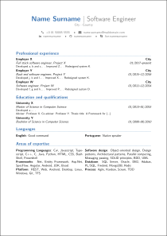

# Multilingual résumé template
> This repository contains a template for building a multilingual résumé

[](https://travis-ci.org/bmgandre/multilingual-resume-template)

## Sample résumé



## Building and running

### Software requirements
```
grep
which
git
make
texlive-most
po4a
```

### Building locally
```console
$ git clone https://github.com/bmgandre/multilingual-resume-template.git
$ cd multilingual-resume-template/
$ mkdir build
$ make DESTDIR=build
```

### Building using a Docker image

```console
$ git clone https://github.com/bmgandre/multilingual-resume-template.git
$ cd multilingual-resume-template/
$ docker run -dit \
    --name build_container \
    -v $(pwd):/src \
    bmgandre/docker-archlinux-texlive:0.2.0 bash
$ mkdir build
$ docker exec -it build_container \
    bash -l -c 'cd /src; make DESTDIR=build'
```
